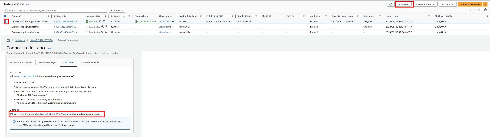

This folder contains all the secret sauce needed to spin up the AWS EC2 instance that hosts the application.
 
Follow these steps:
1. Set these environment variables. Reminder - these access keys were [generated from the AWS Security credentials page](https://us-east-1.console.aws.amazon.com/iam/home#/security_credentials).
```
export AWS_ACCESS_KEY_ID=<get from lastpass>
export AWS_SECRET_ACCESS_KEY=<get from lastpass>
```
2. `cd infrastructure`
3. Make sure you have `/home/richard/Projects/CityBikeWeather/learn-terraform-aws-instance/aws_key.pem` (also in lastpass)
4. `terraform init && terraform apply`
5. Connect to EC2 instance 